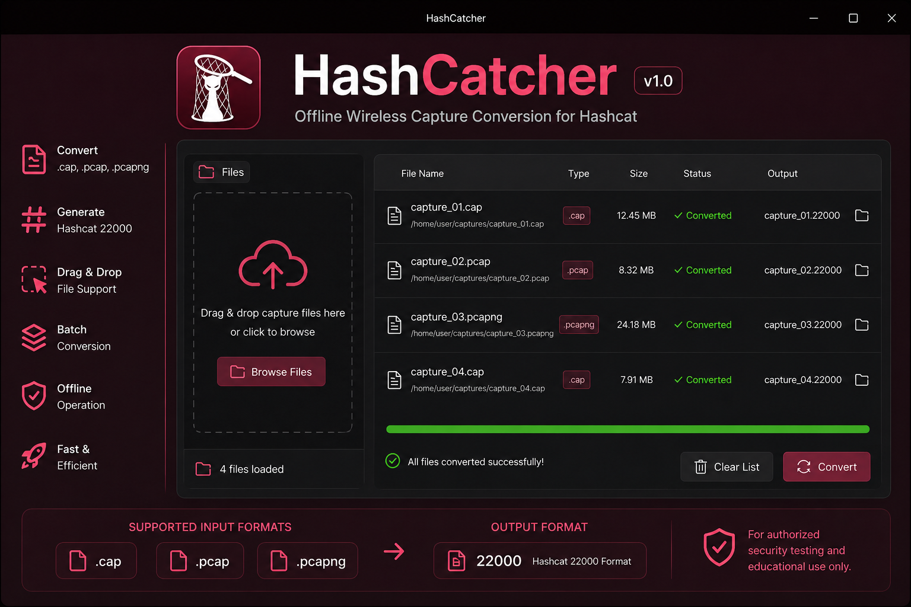

<div align="center">

# 🐾 HashCatcher (In Develeopment)

### Offline Wireless Capture → Hashcat 22000 Converter



<br>


<br>

Fast. Offline. Desktop-native. Optimized for Hashcat workflows.

</div>

---

# 📖 Overview

HashCatcher is a modern graphical desktop application designed for converting wireless capture files into Hashcat-compatible `22000` format using `hcxtools`.

The application simplifies wireless auditing workflows by providing:

- drag & drop importing
- batch conversion queues
- real-time progress tracking
- multi-threaded processing
- desktop integration
- cross-platform packaging
- offline operation

HashCatcher is intended for:

- authorized wireless auditing
- password recovery workflows
- educational research
- penetration testing environments

---

# ✨ Features

---

## 📂 Supported Input Formats

- `.cap`
- `.pcap`
- `.pcapng`

---

## 🔐 Output Format

- Hashcat `22000`

---

# ⚡ Core Features

| Feature | Description |
|---|---|
| 🖱 Drag & Drop | Import captures directly into GUI |
| 📦 Batch Queue | Convert multiple captures simultaneously |
| ⚡ Multi-threaded Engine | Optimized queue processing |
| 🌙 Low Resource Mode | Safe for laptops & virtual machines |
| 🖥 Desktop Integration | Native launcher integration |
| 🔒 Offline Operation | No internet required |
| 🌐 Cross Platform | Linux / Windows / macOS |
| 🧠 hcxtools Integration | Native Hashcat workflow support |
| 📊 Progress Tracking | Real-time conversion progress |
| 🛡 Safe Execution | Isolated subprocess handling |

---

# 🖼 Interface Preview

<div align="center">


</div>

---

# 🖥 Supported Platforms

| Platform | Package |
|---|---|
| 🐧 Linux | `.deb` |
| 🐧 Linux | `AppImage` |
| 🐧 Linux | `Flatpak` |
| 🪟 Windows | `.exe` |
| 🍎 macOS | `.dmg` |

---

# 📦 Prebuilt Packages

Prebuilt packages are available in the GitHub Releases section.

## Download

Visit:

https://github.com/Tahsasiyahu/HashCatcher/releases

Available packages:

- Debian Package (`.deb`)
- AppImage
- Flatpak
- Windows Installer (`.exe`)
- macOS Disk Image (`.dmg`)

---

# ⚙ Installation

---

# 🐧 Debian / Ubuntu Installation

## 1. Download package

Example:

```text
hashcatcher_1.0.0.deb
```

---

## 2. Install package

```bash
sudo dpkg -i hashcatcher_1.0.0.deb
```

---

## 3. Fix dependencies if required

```bash
sudo apt -f install
```

---

## 4. Launch application

From terminal:

```bash
hashcatcher
```

or from application menu:

```text
Applications → Utilities → HashCatcher
```

---

# 🚀 AppImage Installation

## Make executable

```bash
chmod +x HashCatcher.AppImage
```

---

## Launch

```bash
./HashCatcher.AppImage
```

---

# 📦 Flatpak Installation

## Install Flatpak runtime

```bash
sudo apt install flatpak
```

---

## Install package

```bash
flatpak install hashcatcher.flatpak
```

---

## Launch

```bash
flatpak run io.hashcatcher.HashCatcher
```

---

# 🪟 Windows Installation

## 1. Download installer

Example:

```text
HashCatcher_Setup.exe
```

---

## 2. Launch installer

Double-click installer.

---

## 3. Follow installation wizard

If Windows SmartScreen appears:

- Click `More Info`
- Click `Run Anyway`

---

## 4. Launch

```text
Start Menu → HashCatcher
```

---

# 🍎 macOS Installation

## 1. Open DMG

```text
HashCatcher.dmg
```

---

## 2. Drag application

Move:

```text
HashCatcher.app
```

into:

```text
Applications
```

---

## 3. Launch

```text
Applications → HashCatcher
```

---

# ⚙ Build From Source

---

# 1. Clone Repository

```bash
git clone https://github.com/Tahsasiyahu/HashCatcher.git
```

Enter project:

```bash
cd HashCatcher
```

---

# 2. Install Dependencies

## Debian / Ubuntu

```bash
sudo apt update

sudo apt install -y \
    python3 \
    python3-pip \
    python3-pyside6 \
    hcxtools \
    hashcat \
    git
```

---

# 3. Install Python Packages

```bash
pip install -r requirements.txt
```

---

# 4. Run Application

```bash
python3 src/main.py
```

---

# 5. Build Debian Package

Make build script executable:

```bash
chmod +x scripts/build_deb.sh
```

Build package:

```bash
./scripts/build_deb.sh
```

Generated package:

```text
dist/hashcatcher_1.0.0.deb
```

---

# 🚀 One-Click Setup

HashCatcher includes automated setup scripts.

Run:

```bash
chmod +x setup_hashcatcher.sh
```

Execute:

```bash
./setup_hashcatcher.sh
```

This automatically:
- installs dependencies
- creates package structure
- builds `.deb`
- initializes Git repository

---

# 🌐 GitHub Actions Auto Build

HashCatcher supports automated release builds using GitHub Actions.

Workflow:

```text
.github/workflows/release.yml
```

---

# 🚀 Trigger Automatic Release Build

Create release tag:

```bash
git tag v1.0.0
```

Push tag:

```bash
git push origin v1.0.0
```

GitHub automatically:
- builds Linux package
- builds Windows executable
- builds macOS package
- uploads release assets

---

# 📂 Output Directory

Generated files appear in:

```text
output/
```

Example:

```text
capture.pcapng.22000
```

---

# 🔧 Troubleshooting

---

# ❌ Error:
```text
src refspec main does not match any
```

## Fix

```bash
git add .

git commit -m "Initial release"

git branch -M main

git push -u origin main
```

---

# ❌ Error:
```text
Authentication failed
```

## Cause

GitHub no longer supports password authentication.

---

## Fix

Create Personal Access Token:

https://github.com/settings/tokens

Use token instead of GitHub password.

---

# ❌ Error:
```text
failed to push some refs
```

## Fix

```bash
git push -u origin main --force
```

---

# ❌ Error:
```text
hcxtools not found
```

## Fix

```bash
sudo apt install hcxtools
```

---

# ❌ Error:
```text
ModuleNotFoundError: PySide6
```

## Fix

```bash
sudo apt install python3-pyside6
```

or:

```bash
pip install PySide6
```

---

# ❌ Error:
```text
Permission denied
```

## Fix

```bash
chmod +x scriptname.sh
```

---

# ❌ Application does not launch

## Possible causes

- missing Qt dependencies
- broken Python packages
- missing hcxtools

---

## Fix

```bash
sudo apt install -f
```

Then reinstall dependencies.

---

# ⚡ Performance

HashCatcher is optimized for:

- low CPU usage
- low memory usage
- background-safe execution
- large capture batch processing
- multi-core systems

---

# 🔐 Security Notice

HashCatcher is intended exclusively for:

- authorized security testing
- educational environments
- legal wireless auditing

Unauthorized access to systems or credentials may violate laws and regulations.

---

# 📜 License

GPL-3.0

---

# 🙏 Credits

## Developed By

Tahsasiyahu

---

## Technologies Used

- Python
- PySide6 / Qt6
- hcxtools
- Hashcat
- GitHub Actions

---

## Open Source Components

### hcxtools
Wireless capture conversion utilities.

### Hashcat
Advanced password recovery framework.

### Qt / PySide6
Cross-platform graphical interface framework.

---

<div align="center">

# 🐾 HashCatcher

### Catching Hashes Efficiently

</div>
